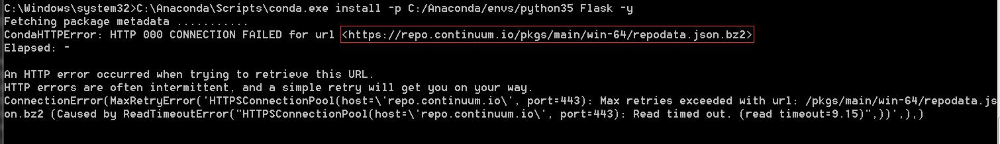

# Anaconda源设置-添加国内镜像源

## 背景
Anaconda使用conda命令来安装和管理第三方工具包，但由于网络原因，使用默认的源进行在线安装时，速度慢的无法忍受，所以使用Anaconda之前的第一步就是配置一个合适的源，目前清华大学提供的镜像速度非常快
清华镜像具体地址见：https://mirrors.tuna.tsinghua.edu.cn/help/anaconda/

## 配置方法
### Linux环境
(暂略)

### Windows环境
1. 在cmd命令行中执行以下命令
   
    ```
    conda config --add channels https://mirrors.tuna.tsinghua.edu.cn/anaconda/pkgs/free/
    conda config --add channels https://mirrors.tuna.tsinghua.edu.cn/anaconda/pkgs/main/
    conda config --add channels https://mirrors.tuna.tsinghua.edu.cn/anaconda/cloud/conda-forge/
    conda config --add channels https://mirrors.tuna.tsinghua.edu.cn/anaconda/cloud/msys2/
    conda config --set show_channel_urls yes
    ```

2. 配置完成后可以在"C:\\Users\\$USER\\.condarc"文件中查看到结果
   
    ```
    channels:
      - https://mirrors.tuna.tsinghua.edu.cn/anaconda/pkgs/main/
      - https://mirrors.tuna.tsinghua.edu.cn/anaconda/pkgs/free/
      - https://mirrors.tuna.tsinghua.edu.cn/anaconda/cloud/conda-forge/
      - https://mirrors.tuna.tsinghua.edu.cn/anaconda/cloud/msys2/
      - defaults
    show_channel_urls: true
    ```
    > **注意：** 在使用中可能会出现问题，详见常见问题1

3. 此时即可使用"conda install"命令快速安装软件包


### 常见问题
1. 即使配置了清华的镜像源，很多时候仍然会出现以下异常:仍然使用了默认的源
   解决方法：将 condarc 文件 channels 字段中的 defaults一行 去掉即可
    
    ```
    channels:
      - https://mirrors.tuna.tsinghua.edu.cn/anaconda/pkgs/main/
      - https://mirrors.tuna.tsinghua.edu.cn/anaconda/pkgs/free/
      - https://mirrors.tuna.tsinghua.edu.cn/anaconda/cloud/conda-forge/
      - https://mirrors.tuna.tsinghua.edu.cn/anaconda/cloud/msys2/
    show_channel_urls: true
    ```
   